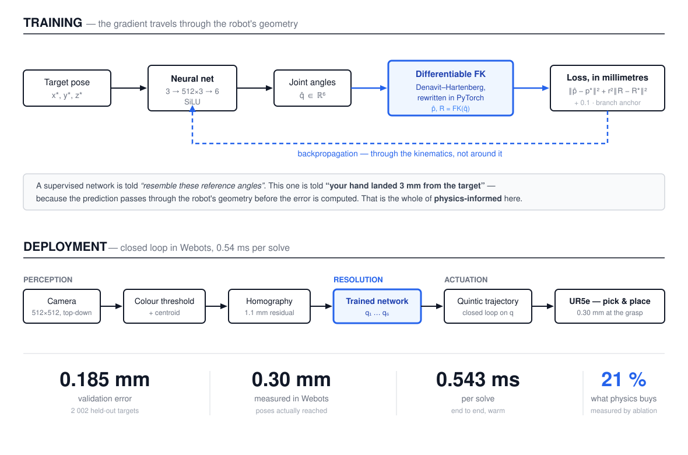
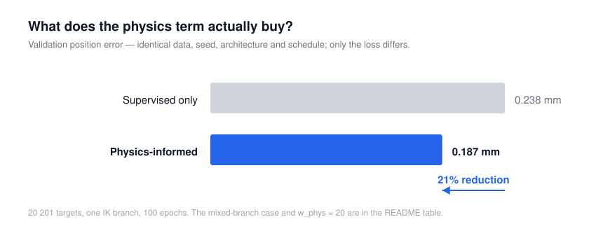
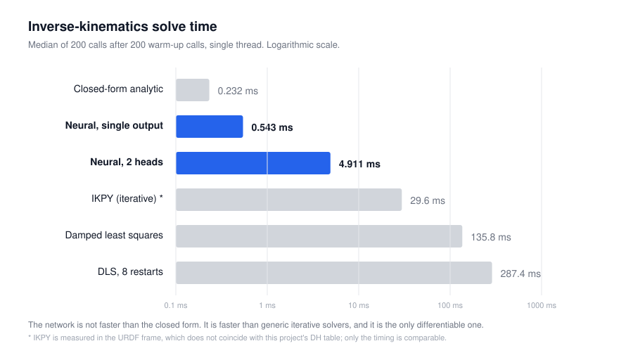

# UR5e Neural Kinematics

**Physics-informed neural inverse kinematics for a 6-DOF industrial manipulator —
benchmarked against closed-form and iterative solvers, and validated in
closed-loop Webots simulation.**

[](https://www.python.org/downloads/)
[](https://pytorch.org/)
[](https://cyberbotics.com/)
[](LICENSE)



<!-- Remplacer l'image ci-dessous par un GIF de 6 a 10 s : cube detecte,
     approche, saisie, transport, depose, retour. Voir GUIDE_DES_CODES.md ch. 25. -->


---

## Results at a glance

| Metric | Result |
| :-- | ---: |
| Neural IK validation error | **0.185 mm / 0.009°** |
| Closed-loop error measured in Webots | **0.30 mm** |
| Inference, end to end | **0.543 ms** |
| Against a generic iterative solver | **~55× faster** |

The full benchmark, the ablation that quantifies the physics term, and the
claims this project measured and then withdrew are below.

---

## Contents

- [How it works](#how-it-works)
- [The physics-informed loss](#the-physics-informed-loss)
- [Experiment 1 — What is the physics term actually worth?](#experiment-1--what-is-the-physics-term-actually-worth)
- [Experiment 2 — Modelling the IK branches instead of avoiding them](#experiment-2--modelling-the-ik-branches-instead-of-avoiding-them)
- [Experiment 3 — Continuity, and the reach boundary](#experiment-3--continuity-and-the-reach-boundary)
- [Kinematics from first principles](#kinematics-from-first-principles)
- [Benchmarks](#benchmarks)
- [Limitations](#limitations)
- [Experimental validation, and negative results](#experimental-validation-and-negative-results)
- [Quickstart](#quickstart)
- [Repository layout](#repository-layout)
- [Provenance](#provenance)

---

## How it works

```
[ Webots camera ] --> [ colour detector + homography ] --> target (x, y, z)
                                                                |
                                                                v
[ joint motors ] <-- [ q1 ... q6 ] <-- [ physics-informed neural IK ]
```

**Perception.** The arm moves to a calibrated reading pose, thresholds the red
cube, and maps its centroid through a homography fitted on measured
correspondences. Median residual 1.1 mm.

**Resolution.** The 3D coordinate goes into the network, which returns the six
joint angles.

> **Scope, stated precisely.** The manipulator has 6 degrees of freedom, but the
> network solves a **position-only IK problem at a fixed tool orientation**: it
> maps R³ to R⁶, with the tool held at `[pi, 0, -pi/2]` (gripper pointing
> straight down) throughout training. This is the natural restriction for
> top-down pick-and-place. Full 6-DoF *pose* IK would require feeding the
> orientation in as an input and regenerating the dataset — it is **not** what
> this repository demonstrates.

**Actuation.** Quintic-polynomial trajectories, closed-loop on joint position.
The position hold removed a measured 114 mm of accumulated open-loop error.

---

## The physics-informed loss

A purely supervised network is trained to *resemble* reference joint angles. It
has no notion of a robot, so a small error on q2 counts the same as a small error
on q6 — although the first moves the hand by centimetres and the second by a
hair.

This network is corrected on **where its hand actually lands**. The predicted
angles are pushed through a Denavit-Hartenberg forward kinematics rewritten in
PyTorch ([`src/kinematics/ur5_pytorch_fk.py`](src/kinematics/ur5_pytorch_fk.py)),
which makes it a differentiable link in the computation graph: the gradient
travels through the geometry of the robot, and the quantity being minimised is
**millimetres of end-effector error**.

$$L = w_d \cdot \lVert q - q_{ref} \rVert^2 + w_p \cdot \left( \lVert p - p^{*} \rVert^2 + r_{tool}^2 \cdot \lVert R - R_{ref} \rVert_F^2 \right)$$

where $p$ and $R$ come from $FK(q)$, with $w_d = 0.1$, $w_p = 1.0$ and
$r_{tool} = 0.05$ m.

Three implementation choices worth naming:

- **The orientation term is compared against $FK(q_{ref})$**, not against a
  matrix rebuilt from Euler angles — both sides pass through the same forward
  kinematics, so no angle convention can introduce a spurious gap. Without this
  term the loss is blind to orientation: rotating q6 by 180° moves the point by
  zero microns but flips the gripper, and both poses score identically.
- **Frobenius norm rather than geodesic distance**, whose $\arccos$ has a
  gradient that diverges near zero — exactly where the network must converge.
- **$r_{tool}^2$ makes the two terms commensurable.** A position error is in m²,
  a rotation error is dimensionless. Weighting by the square of a characteristic
  tool length converts a 1° rotation into the 0.9 mm of tip displacement it
  actually causes.

| Metric | Value |
| :-- | ---: |
| Position error, validation (2 002 held-out targets) | **0.185 mm** |
| Orientation error, validation | **0.009°** |
| Position error measured *in Webots* at the grasp point † | **0.30 mm** |

The last row is the only one that really counts: it is obtained by driving to the
same target with the closed-form solver and then with the network, and comparing
the poses **actually reached** — so it includes the DH model, the motor servo
loop and the physics engine, not just the network's internal consistency.

† Measured before the orientation term was added. The current model is better on
validation but has not been re-measured in simulation; the figure is reported
as-is rather than silently attributed to the newer weights.

---

## Experiment 1 — What is the physics term actually worth?

An earlier version of this README asserted that *"a standard supervised network
averages the 8 IK solutions, resulting in invalid joint configurations, and our
PINN resolves this ambiguity."* That claim was **not tested by the experiment**:
both dataset generators filter to a single solution family before training, so
there was never anything to average.

[`experiments/ablation_physics_loss.py`](experiments/ablation_physics_loss.py)
replaces the claim with a measurement — a 2 × 3 design holding everything
constant (same seed, same 20 201 targets, same architecture, same 100 epochs,
same schedule, same selection criterion) except the two variables.

| Training data | $w_p = 0$ (supervised) | $w_p = 1$ (shipped) | $w_p = 20$ |
| :-- | ---: | ---: | ---: |
| **One IK branch** | 0.238 mm / 0.012° | **0.187 mm / 0.011°** | 0.180 mm / 0.044° |
| **Branches mixed** | 911 mm / 99.0° | 69.6 mm / 98.6° | 3.68 mm / 71.6° |

**On the data this project actually uses, the physics term is worth 21 %** —
0.238 mm down to 0.187 mm. Real, reproducible, and far more modest than "invalid
joint configurations". Note also that $w_p = 20$ buys a further 0.007 mm of
position at the cost of **4× worse orientation**, which is why $w_p = 1$ is the
shipped setting.

**The premise was right, but it was never this project's situation.** Trained on
mixed branches, the supervised network does collapse to 911 mm — it predicts the
mean configuration, which reaches nowhere near the target. That failure is real.
It is simply not the failure this project avoids, because the single branch is
forced in the *data generator*, not by the loss.

**And the physics term alone does not fix it.** At $w_p = 1$ the mixed-branch
model never improves past its first epoch. At $w_p = 20$ it reaches 3.68 mm — a
250× improvement over supervised, but still 20× worse than the single-branch
model and with 71.6° of orientation error, unusable for grasping.

---



## Experiment 2 — Modelling the IK branches instead of avoiding them

Experiment 1 measured a **structural** failure, not a tuning problem. A network
is a *function*: it returns one value per input. The average of two valid joint
configurations is a solution to neither.

[`src/models/multihead.py`](src/models/multihead.py) takes it head-on — a shared
trunk with K heads, and a loss that keeps only the best proposal:

```
                      +-- head 1 --> q(1)
(x,y,z) --> trunk ----+-- head 2 --> q(2)
                      +-- ...
                      +-- head K --> q(K)
```

$$L = \min_k L_{phys}\left( q^{(k)} \right)$$

The minimum is **relaxed**: the winner takes weight $1 - \varepsilon$ and the
losers share $\varepsilon$. With a strict minimum, the first head to win receives
all the gradient and the others never train — the classic collapse of this family
of methods.

**The loss is purely physical: no branch labels enter training anywhere.**
Nothing tells the network which head should learn which branch.

### Result

| Training | Position | Orientation | Latency | Branch chosen by hand? |
| :-- | ---: | ---: | ---: | :-: |
| Single head, **one branch** | **0.187 mm** | **0.011°** | **0.248 ms** | yes |
| Single head, mixed branches | 3.684 mm | 71.6° | 0.248 ms | no |
| **2 heads, mixed branches** | **0.314 mm** | 0.202° | 4.61 ms | **no** |

Given the same unlabelled, branch-mixed data on which a single head manages only
3.684 mm with an unusable 71.6° of orientation error, the multi-head network
reaches **0.314 mm and 0.202°** — 12× better in position, 350× better in
orientation, with no supervision about branches at all.

*Best-of-K is a deployable rule, not a cheat:* at inference the forward
kinematics runs on all K outputs and the closest pose wins, using the same
position-plus-orientation weighting as the training loss. The reported latency
includes that selection.

### How many branches actually exist here

Probing the dataset settles a question the earlier write-up got wrong. Of the 8
theoretical branches, **only 4 ever produce a valid solution** once the tool
orientation is fixed downward:

| Branch | Valid on |
| :-- | ---: |
| `left-up-up` | 100 % of targets |
| `right-up-up` | 100 % |
| `left-down-up` | 36.2 % |
| `right-down-up` | 36.2 % |
| the other four | **never** |

Every target has either 2 or 4 valid branches, never 1 and never 8. The heads
concentrate on the two that are always available, so this is **partial coverage,
not a workspace that only offered two**. Per-branch recall is reported by the
experiment script, using a periodic angular distance — two angles at +179° and
−179° differ physically by 2°, not 358°, and a naive norm would mis-assign them.

### How many heads do you actually need?

The obvious follow-up: why 8 heads for a workspace offering at most 4 branches?
The sweep holds everything else constant — same cached dataset (fingerprint
`b9e74b3f`), same seed, same 100 epochs.

| K | Parameters | Position | Orientation | Branch recall | Latency |
| --: | --: | --: | --: | --: | --: |
| 1 | 660 k | 8.881 mm | 17.87° | 11.8 % | 4.34 ms |
| **2** | 793 k | **0.314 mm** | **0.202°** | 36.7 % | 4.61 ms |
| 4 | 1.06 M | 0.357 mm | 0.322° | 82.2 % | 5.23 ms |
| 8 | 1.59 M | 0.439 mm | 0.278° | **86.8 %** | 5.67 ms |

**Accuracy and coverage are different objectives, and they disagree.**

*K = 2 is the most accurate* — 0.314 mm, better than K = 8 at 0.439 mm. Past two
heads, more hypotheses buy no accuracy and cost parameters and time. So far the
expected conclusion.

*But recall keeps climbing*, 36.7 % → 82.2 % → 86.8 %. Best-of-K only needs
**one** head to be right; recovering the *whole* solution set needs more. K = 2
reaches its 0.314 mm through a single branch it reproduces at 99 %, while the
other head merely points in the direction of a second branch without landing on
it. K = 8 reproduces three of the four branches above 88 %.

So the answer depends on the question. **Want one good solution? K = 2. Want the
solution set — for obstacle avoidance, or to pick a branch by some downstream
criterion? K = 8.**

*K = 1 is the control that matters*: same code, same loss, one head — 8.881 mm.
The multi-valued structure of the problem is real, and it is the step from one
head to two that removes it, not the machinery around it. (This control has no
data term at all, unlike the ablation's mixed-branch runs, so the two numbers are
not directly comparable.)

### Where the latency actually goes

K = 1 already costs 4.34 ms, and K = 8 costs 5.67 ms. **The cost is not the
heads** — each additional head is worth about 0.19 ms. It is running the forward
kinematics and the selection at inference at all, which the single-output network
(0.248 ms) never does. A deployment that already needs an FK check for
reachability would pay most of this anyway.

### Three honest caveats

**It does not beat the engineering shortcut.** Against the hand-picked single
branch, K = 2 is 1.7× worse in position, 18× worse in orientation and roughly 19×
slower. For *this* task — one tool orientation, top-down grasping — forcing a
branch in the generator remains the better choice, and the repository still ships
that.

**Branch coverage is unstable across runs.** At K = 4 the `right-down-up` branch
is recovered 0 % of the time while `left-down-up` reaches 81 %; at K = 8 the
pattern inverts, 88 % against 27 %. Which branches the heads claim is not
reproducible from one K to the next — a known consequence of winner-take-all,
and a reason not to over-read any single coverage figure.

**Winner-take-all converges noisily.** Validation error oscillates because the
winner assignment keeps changing, which makes the objective non-stationary. The
saved checkpoint is the best epoch, not the last.

**Where this would actually pay off:** not here. It pays the moment you *cannot*
pick a branch in advance — multiple tool orientations, obstacle avoidance needing
an elbow-down route, or full SE(3) pose IK where the valid branch depends on the
requested orientation. The value of the experiment is showing the ambiguity is
solvable, quantifying what solving it costs, and establishing that two heads
already capture most of the benefit.

---

## Experiment 3 — Continuity, and the reach boundary

An earlier version of this README claimed the network was **continuous** in the
target where analytic solvers "jump between their 8 solution branches". That
claim was never measured. Measuring it refuted it.

[`experiments/mesure_continuite.py`](experiments/mesure_continuite.py) walks a
400-sample circle through the workspace and records the joint-space jump between
consecutive poses:

| Solver | Median jump | p95 | Max |
| :-- | ---: | ---: | ---: |
| Analytic, fixed branch | 0.0084 rad | 0.0108 | 0.0109 |
| Analytic, first valid branch | 0.0084 rad | 0.0108 | 0.0109 |
| Neural | 0.0084 rad | 0.0108 | 0.0109 |

**Identical, and zero branch changes in 399 steps.** With the tool orientation
fixed downward, the preferred branch is valid everywhere the target is reachable
at all. The branch flip this project used to advertise does not occur for this
task.

### The comparison that does separate them goes the other way

| $x$ (m) | Analytic | Neural — error of the pose returned |
| ---: | :-- | ---: |
| +0.40 | solution | 0.2 mm |
| +0.50 | solution | 2.0 mm |
| +0.55 | **exception** | 68 mm |
| +0.60 | **exception** | 389 mm |
| +0.70 | **exception** | **1 460 mm** |

Past the reach limit the analytic solver fails loudly. The network returns six
plausible-looking angles that are a metre and a half wrong, with no signal of any
kind. **This is a defect, not a feature** — any deployment would need an explicit
reachability check in front of the network, because the network will never
provide one.

---

## Kinematics from first principles

Everything in this section is derived and validated here rather than called from
a library.

### The geometric Jacobian

[`src/kinematics/jacobian.py`](src/kinematics/jacobian.py) builds the 6×6
Jacobian column by column, straight from the geometry — no symbolic
differentiation:

$$J_{v,i} = z_{i-1} 	imes (p_e - p_{i-1}), \qquad J_{\omega,i} = z_{i-1}$$

Turning joint *i* rotates everything downstream about the axis $z_{i-1}$; the
hand, at lever arm $p_e - p_{i-1}$, therefore moves with that cross product.

**Validated against finite differences**, not against itself: the analytic
Jacobian is compared to a central-difference derivative of the forward
kinematics over 200 random configurations.

| Check | Result |
| :-- | ---: |
| Max deviation from numerical derivative | **3.2 × 10⁻¹⁰** |
| Mean deviation | 1.5 × 10⁻¹⁰ |

### Singularity measures

| Configuration | Manipulability $\sqrt{\det(JJ^T)}$ | Condition number |
| :-- | ---: | ---: |
| Rest pose | 0.0287 | 16.5 |
| Arm fully extended ($q = 0$) | **0.0000** | **∞** |

The elongation singularity is detected exactly where it should be.

### Damped least squares

[`src/kinematics/ik_dls.py`](src/kinematics/ik_dls.py) solves the IK
iteratively by linearising the kinematics and inverting the Jacobian — except
that near a singularity the pseudo-inverse explodes. Levenberg–Marquardt damping
keeps it bounded:

$$\Delta q = J^T\left(JJ^T + \lambda^2 I
ight)^{-1} e$$

with $e$ the 6-vector pose error, its rotation part taken as the logarithm on
SO(3). The damping is **adaptive**: zero when the arm is well conditioned,
growing as the smallest singular value of $J$ approaches a threshold.

**What the measurement showed.** From a single fixed start it either converges in
about 23 iterations to sub-micron accuracy, or stalls in a local minimum tens of
millimetres away — there is no middle ground, and it fails on **59.5 %** of
workspace targets. This is not a tuning problem; it is what a local method does.
Random restarts are the standard answer, and eight of them bring the failure rate
to **0 %** at roughly double the cost.

That contrast is the point of including DLS at all: it shows concretely what the
closed-form solver buys, and what a generic method costs when you do not have one.

---

## Benchmarks



Reproduced by [`experiments/benchmark_solveurs.py`](experiments/benchmark_solveurs.py).
200 targets, 200 warm-up calls discarded, single thread. Timings are measured at
the call site — including the NumPy-to-tensor conversion the caller actually pays.

| Solver | Median | Mean | p95 | Error | Failures | Differentiable |
| :-- | ---: | ---: | ---: | ---: | ---: | :-: |
| Closed-form analytic | **0.232 ms** | 0.272 | 0.488 | exact | 0 % | no |
| Neural, single output | 0.543 ms | 0.607 | 1.196 | 0.165 mm | 0 % | **yes** |
| Neural, 2 heads + selection | 4.911 ms | 5.085 | 7.679 | 0.253 mm | 0 % | **yes** |
| Damped least squares, one start | 135.8 ms | 96.2 | 165.0 | exact | **59.5 %** | no |
| Damped least squares, 8 restarts | 287.4 ms | 190.3 | 341.5 | exact | 0 % | no |
| IKPY (iterative) † | 29.6 ms | 31.1 | 45.6 | — | 0 % | no |

**Read this honestly.** The network is **2.3× slower** than the closed-form
solution, not faster. No neural network will beat a few dozen trigonometric
operations. What it buys is being **~55× faster than a generic iterative solver**
and **differentiable**, which neither of the others is.

† **IKPY is measured in its own frame, and its error is not comparable.** The
URDF chain and this project's DH table do not describe the same robot: for
identical joint angles the two forward kinematics place the end-effector **1.3 to
1.8 m apart**. Evaluating IKPY on DH-frame targets measured that convention
mismatch, not the solver. It is therefore given targets drawn from its own
forward kinematics; only the timings are comparable. Reconciling the two models
is open work.

> **This table has now been corrected three times.** It once claimed the network
> was faster than the closed-form solver (measured cold against warm). It then
> claimed 0.248 ms by timing only the tensor forward pass, excluding the
> conversion a caller cannot avoid. And it quoted a 182× speed-up over IKPY that
> was measured across incompatible frames. Each correction made the project look
> less impressive and the numbers more trustworthy.

## Limitations

| Limitation | Evidence |
| :-- | :-- |
| **Extrapolates poorly outside the training box.** Above the drop-off tray ($x = -0.20$, outside the learned $[0, 0.4]$), error rises to 7–11 mm. | `mesurer_erreur_pinn()`, four scenario waypoints |
| **Fails silently out of reach**, up to 1.46 m of error with no signal. | Experiment 3 |
| **One tool orientation only.** The gripper cannot approach from the side. | `ROT_DOWN` hard-coded in the generator |
| **One IK branch** in the shipped model. It cannot route around an obstacle via the elbow-down family. | generator forces `wrist='up', shoulder='left', elbow='up'` |
| **Not faster than the closed-form solver** — 2.3× slower. The speed claim is against generic iterative solvers, not against trigonometry. | Benchmarks |
| **The grasp height sits 20 mm below the trained $z$ range** ($z = 0.030$ against a learned $[0.05, 0.45]$). Error stays at 0.30 mm, so it is not urgent, but retraining on $z \in [0.02, 0.45]$ would be cleaner. | `GRASP_Z` against the generator bounds |

---

## Experimental validation, and negative results

Three claims that appeared in earlier versions of this README were **measured
and withdrawn**: a speed advantage over the closed-form solver, a continuity
advantage over analytic solvers, and the assertion that a supervised network
"averages the 8 IK solutions". Each was replaced by the experiment that refuted
it — Experiments 1 and 3, and the benchmark.

The method that caught them is worth more than any single result.

- **Every timing discards 200 warm-up calls** and pins `torch.set_num_threads(1)`.
  The first published table compared a cold PyTorch against a warm NumPy.
- **Accuracy is measured on the robot, not on the model.** Verifying a network by
  running its output back through the same forward kinematics only tests internal
  consistency. The reported error compares poses *actually reached* in the physics
  engine against a closed-form solver on identical targets.
- **The measurement campaign runs after the scenario, never before.** Placed
  first, it nudged the cube and the demo then used stale coordinates — a bug that
  looked exactly like "the network does not work".
- **Every IK solution is validated by forward kinematics before entering a
  dataset.** `inverse_kinematics` returns finite but wrong angles for some branch
  combinations — up to 784 mm off. Filtering on `NaN` is not enough.
- **Experiments share one cached dataset and report its fingerprint**, so "the
  same targets" is a verifiable statement rather than an assumption.
- **Claims are tested by ablation, not asserted.** Three claims in this README
  were removed because the experiment designed to support them refuted them.

---

## Quickstart

```bash
git clone https://github.com/clementdumeril/ur5e-neural-kinematics.git
cd ur5e-neural-kinematics
pip install -r requirements.txt
```

**Also required:** Webots R2023a or later (tested on R2025a), and an internet
connection on first launch — the worlds pull their `UR5e`, `PandaHand` and
`Table` PROTO definitions from GitHub via `EXTERNPROTO`.

**Run the demo.** Open `webots/worlds/my_first_simulation_pandahand.wbt` and
press Play. The arm reads the cube position from its camera, solves the IK with
the network, grasps the cube and transfers it to the tray.

**Reproduce the results.**

```bash
python tests/test_smoke.py                      # imports, paths, a known target   (seconds)
python src/training/train_true_pinn.py          # retrain the network              (~8 min)
python experiments/ablation_physics_loss.py     # what the physics term is worth   (~1 h)
python experiments/multihypothesis_ik.py        # multi-valued IK                  (~55 min)
python experiments/mesure_continuite.py         # continuity and reach boundary    (~1 min)
```

<details>
<summary><b>If Webots uses the wrong Python interpreter</b></summary>

The controllers use whichever `python` is on your `PATH`. If that interpreter
lacks the dependencies, add a `COMMAND` line to `webots/controllers/*/runtime.ini`:

```ini
[python]
COMMAND = C:/path/to/your/python.exe
```

Webots does **not** support `#` comments in `runtime.ini` — it reads them as
unknown keys and warns about each one.
</details>

<details>
<summary><b>On the vision model, and why you do not need it</b></summary>

The CNN weights (`vision/vgg16.h5`, 37 MB) are not tracked. The default
perception mode is `VISION_MODE = "color"`, a colour-threshold detector that
needs no model and is **more accurate than the CNN**: 8 mm against 49 mm on the
same 200 validation images. The CNN is kept as a documented negative result.
Without TensorFlow installed, the simulation stays in colour mode and runs end
to end.

`data/calibration.json` **is** included — it holds the camera pose and the
pixel-to-world homography, without which the colour detector cannot work.
</details>

---

## Repository layout

```
ur5e-neural-kinematics/
├── src/
│   ├── kinematics/              # DH forward kinematics (NumPy and differentiable
│   │                            # PyTorch), geometric Jacobian, damped least-squares
│   │                            # IK, closed-form IK, SE(3) product of exponentials,
│   │                            # quintic trajectories, IKPY baseline
│   ├── models/                  # pinn.py (single head), multihead.py (K heads + WTA)
│   ├── training/                # physics-informed and supervised training scripts
│   └── control/ur5.py           # robot driver, IK bridge, perception
│
├── experiments/                 # ablation, multi-hypothesis IK, continuity, solver benchmark
├── webots/                      # worlds and scenario controllers
├── checkpoints/                 # trained weights and raw experiment results
├── vision/  data/               # CNN detector (negative result), camera calibration
├── tests/test_smoke.py          # imports, paths, and a known-target check
│
├── CREDITS.md                   # what is inherited, what was built here
├── GUIDE_DES_CODES.md           # file-by-file walkthrough (FR, 23 chapters)
└── DOCUMENTATION.md             # technical report (FR)
```

---

## Provenance

The Webots scene and the base of `ur5.py` — DH kinematics, closed-form IK,
Jacobian, quintic trajectories — come from
[`allan-almeida1/ur5-pick-and-place-webots`](https://github.com/allan-almeida1/ur5-pick-and-place-webots)
(MIT).

The differentiable PyTorch forward kinematics, the neural IK and its
physics-informed training, the multi-hypothesis formulation, the experiments, the
perception rebuild and the measurement methodology were developed here.
[`CREDITS.md`](CREDITS.md) states the boundary file by file.

Distributed under the MIT License. See [`LICENSE`](LICENSE).
